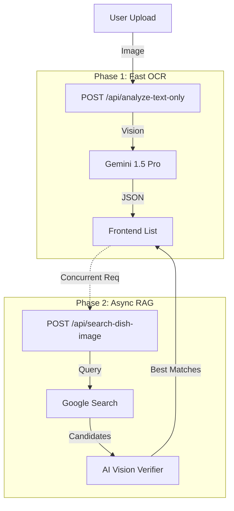

# 🍽️ MenuLens
> **AI-Powered Visual Menu Explorer**  
> *Turn any text menu into a visual feast with Gemini AI & RAG Search.*


## ✨ Overview

MenuLens is a modern full-stack application that helps travelers and foodies understand foreign menus instantly. 

It uses **Google Gemini 1.5 Pro** to extract dishes from menu photos and a **Hybrid RAG Pipeline** (Retrieval-Augmented Generation) to automatically find, verify, and display high-quality images for each dish.

Whether you're in a local diner or a foreign country, MenuLens visualizes what you're about to eat.

## 🚀 Key Features

- **📸 AI Menu Recognition**: Instantly extracts dish names, prices, and descriptions from raw menu photos using Gemini Vision.
- **🔍 Hybrid Image Search**: 
  - Retrieves multiple candidate images via Google Search API.
  - Uses **AI Vision Verification** (Gating) to ensure images match the dish description.
  - Auto-skips low-quality or irrelevant images.
- **⚡️ Optimistic UI**: 
  - **Instant Text**: See the dish list in seconds while images load in the background.
  - **Async Loading**: Images "pop" in one by one without blocking the interface.
- **🎨 Immersive Split-Layout**: 
  - **Master Panel**: Scrollable dish list with thumbnails.
  - **Detail Panel**: High-res lightbox viewer, TTS pronunciation, and rich details.
- **🗣️ Text-to-Speech**: Native pronunciation support for dish names to help you order like a local.

## 🛠️ Tech Stack

### Frontend
- **React 19** + **Vite** (Fast, modern UI)
- **Tailwind CSS** (Responsive & Glassmorphism styling)
- **Axios** (API communication)

### Backend
- **FastAPI** (High-performance Python async API)
- **Google Gemini 1.5 Pro** (LLM for OCR & Logic)
- **Google Custom Search API** (Image sourcing)
- **AsyncIO** (Concurrent processing for speed)

## 🧩 Architecture

MenuLens uses a **Two-Stage Pipeline** for maximum performance:



## 🏁 Getting Started

### Prerequisites
- Python 3.9+
- Node.js 18+
- **Google Gemini API Key** (AI Studio)
- **Google Custom Search API Key & Engine ID** (Programmable Search Engine)

### 1. Backend Setup

```bash
cd backend

# Create virtual environment
python -m venv venv
source venv/bin/activate  # Windows: venv\Scripts\activate

# Install dependencies
pip install -r requirements.txt

# Configure Environment
cp .env.example .env
# Edit .env and fill in your LLM_API_KEY and SEARCH_API_KEY
```

**Run the Backend:**
```bash
uvicorn main:app --reload --port 8000
```

### 2. Frontend Setup

```bash
cd frontend

# Install dependencies
npm install

# Configure Environment
cp .env.example .env
# Ensure VITE_API_BASE_URL=http://localhost:8000
```

**Run the Frontend:**
```bash
npm run dev
```

Visit `http://localhost:5173` to start exploring!

## 📂 Project Structure

```
MenuLens/
├── backend/
│   ├── main.py              # FastAPI entry & endpoints
│   ├── services/
│   │   ├── llm_service.py   # Gemini OCR Logic
│   │   ├── search_service.py# Google Search Wrapper
│   │   ├── hybrid_pipeline.py # RAG Logic (Search + Verify)
│   │   └── image_verifier.py  # AI Image Scoring
│   └── schemas.py           # Pydantic Models
├── frontend/
│   ├── src/
│   │   ├── components/      # UI Components (MasterPanel, DetailPanel...)
│   │   ├── api/             # API Client
│   │   └── App.jsx          # Layout & State Logic
└── README.md
```

## 📜 License

MIT License. Open source and free to use.
