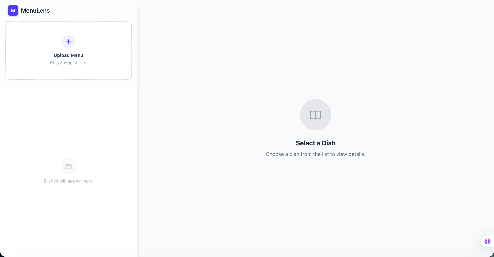

# 🍽️ MenuLens
> **AI-Powered Visual Menu Explorer**  
> *Turn any text menu into a visual feast with Gemini AI & RAG Search.*


[](https://menulens-vert.vercel.app/)
## ✨ Overview

MenuLens is a modern full-stack application that helps travelers and foodies understand foreign menus instantly. 

It uses **Google Gemini 2.0 Flash Lite** (optimized for speed and cost) to extract dishes from menu photos and a **Hybrid RAG Pipeline** (Retrieval-Augmented Generation) to automatically find, verify, and display high-quality images for each dish.

Whether you're in a local diner or a foreign country, MenuLens visualizes what you're about to eat.

## 🚀 Key Features

- **📸 AI Menu Recognition**: Instantly extracts dish names, prices, and descriptions from raw menu photos using **Gemini 2.0 Flash Lite**.
- **🌍 Global Language Support**: 
  - Select your preferred language (English, Chinese, Japanese, etc.) for descriptions.
  - Automatically translates dish details while keeping original names for ordering.
- **💱 Smart Currency Converter**: 
  - Define the menu's source currency (e.g., JPY) and your target currency (e.g., USD).
  - Instantly see prices converted to your home currency.
- **🥦 Dietary Filters**: 
  - Smartly tags dishes (Vegan, Spicy, Contains Pork, etc.).
  - Filter the menu instantly to match your dietary needs.
- **🔍 Hybrid Image Search**: 
  - Retrieves multiple candidate images via Google Search API.
  - Uses **AI Vision Verification** to score image relevance (Match Score).
  - Displays confidence badges (e.g., "⚡ 95% Match" vs "⚠️ 60% Match").
- **⚡️ Optimistic UI**: 
  - **Instant Text**: See the dish list in seconds while images load in the background.
  - **Progress Tracking**: Real-time progress bar showing image search status.
- **🎨 Immersive Detail View**: 
  - High-res lightbox viewer with zoom.
  - **🗣️ Text-to-Speech**: Native pronunciation support for dish names.
  - **Ingredients List**: AI-inferred main ingredients for every dish.

## 🛠️ Tech Stack

### Frontend
- **React 19** + **Vite** (Fast, modern UI)
- **Tailwind CSS** (Responsive & Glassmorphism styling)
- **Framer Motion** (Smooth animations)
- **Vaul** (Mobile-native drawer experience)
- **Lucide React** (Beautiful iconography)

### Backend
- **FastAPI** (High-performance Python async API)
- **Google Gemini 2.0 Flash Lite** (LLM for OCR, Translation & Logic)
- **Google Custom Search API / SerpAPI** (Image sourcing)
- **CLIP / Vision Model** (Image verification & scoring)
- **AsyncIO** (Concurrent processing for speed)

## 🧩 Architecture

MenuLens uses a **Two-Stage Pipeline** for maximum performance:

```mermaid
graph TD
    User[User Upload] --> |Image + Config| API_1[POST /api/analyze-text-only]
    
    subgraph "Phase 1: Fast OCR & Analysis"
        API_1 --> |Vision| Gemini[Gemini 2.0 Flash Lite]
        Gemini --> |JSON (Dishes + Tags)| Client[Frontend List]
    end
    
    subgraph "Phase 2: Async RAG"
        Client -.-> |Concurrent Req| API_2[POST /api/search-dish-image]
        API_2 --> |Query| Google[Google Search]
        Google --> |Candidates| Verifier[AI Vision Verifier]
        Verifier --> |Scored Images| Client
    end
```

## 🏁 Getting Started

### Prerequisites
- Python 3.9+
- Node.js 18+
- **Google Gemini API Key** (AI Studio)
- **Google Custom Search API Key & Engine ID** (Programmable Search Engine)

### 1. Backend Setup

```bash
cd backend

# Create virtual environment
python -m venv venv
source venv/bin/activate  # Windows: venv\Scripts\activate

# Install dependencies
pip install -r requirements.txt

# Configure Environment
cp .env.example .env
# Edit .env:
# LLM_MODEL=gemini-2.0-flash-lite-preview-02-05
# LLM_API_KEY=your_key
# SEARCH_API_KEY=your_key
```

**Run the Backend:**
```bash
uvicorn main:app --reload --port 8000
```

### 2. Frontend Setup

```bash
cd frontend

# Install dependencies
npm install

# Configure Environment
cp .env.example .env
# Ensure VITE_API_BASE_URL=http://localhost:8000
```

**Run the Frontend:**
```bash
npm run dev
```

Visit `http://localhost:5173` to start exploring!

## 📂 Project Structure

```
MenuLens/
├── backend/
│   ├── main.py              # FastAPI entry & endpoints
│   ├── services/
│   │   ├── llm_service.py   # Gemini Logic (Prompting & OCR)
│   │   ├── search_service.py# Search API Wrapper
│   │   ├── hybrid_pipeline.py # RAG Logic (Search + Verify)
│   │   └── image_verifier.py  # Image Relevance Scoring
│   └── schemas.py           # Pydantic Models
├── frontend/
│   ├── src/
│   │   ├── components/      # UI Components (MasterPanel, DetailPanel...)
│   │   ├── api/             # Axios Client
│   │   ├── utils/           # Currency & Helper functions
│   │   └── App.jsx          # Main Layout & State Logic
└── README.md
```

## 📜 License

MIT License. Open source and free to use.
